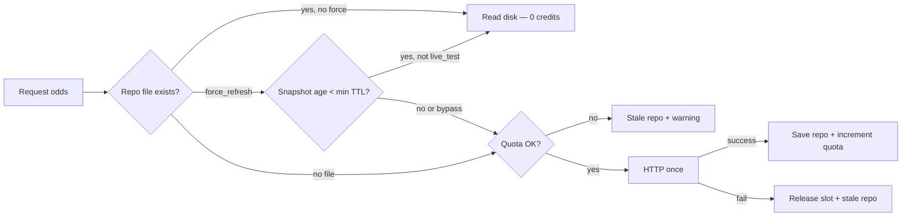

# Local development

## Visual layer

App pages use a **pure CSS** depth stack — no image assets folder required.

| Layer | Implementation |
|-------|----------------|
| Base | `var(--bg)` (`#0f1419`) on `body` |
| Spotlight | `body::before` — radial accent glow (~6% opacity) + edge vignette |
| Grain | `body::after` — inline SVG `feTurbulence` data-URI tiled at ~3.5% opacity |
| Glass chrome | `.app-topbar`, `.live-ticker` — 85% surface + `backdrop-filter: blur(12px)`; solid `--surface` fallback via `@supports` |
| Game wash | `body.game-page-bg` only — `.game-page-wash` corner blurs from `--game-away-color` / `--game-home-color` (set in JS after matchup load) |
| MLB slate pattern | `body.slate-mlb` — faint diamond stitch on `.app-main` at ≤3% opacity; board/lab stay flat |

**Motion:** `.game-card`, `.glance-card`, and home link cards use a 300ms fade/slide on paint. `prefers-reduced-motion: reduce` disables these animations. Ticker marquee logic is unchanged.

**Hero chips:** Home `#hero-chips` row is filled from the existing `/api/home/today`, `/api/scores/today?sport=all`, and `/api/status/refresh` bootstrap — no extra API call.

---

## News headlines (Phase D)

Home page (`/`) shows up to **10** sports headlines from ESPN RSS. Links open ESPN in a new tab — no in-app articles.

| Endpoint | Purpose |
|----------|---------|
| `GET /api/news` | Headlines JSON (15 min disk cache) |
| `GET /api/news?refresh=true` | Bypass cache, refetch feeds |

**Feeds:** ESPN Top + ESPN MLB (`app/services/news_feed.py`).

**Cache:** `data/processed/news_cache.json` — TTL **900s**. On feed failure, serves stale cache when available.

**Response shape:**

```json
{
  "cached_at": "2026-06-06T14:00:00+00:00",
  "cache_ttl_seconds": 900,
  "items": [{ "title", "link", "published", "source", "summary" }],
  "count": 10,
  "cache_hit": false
}
```

**Manual refresh:** `curl http://127.0.0.1:8000/api/news?refresh=true`

---

## NBA slate (Phase S0)

`/nba` shows today's NBA schedule and live scores from the **ESPN scoreboard API** (no API key). Game pages at `/nba/game/{game_id}` reuse the same payload (logos, records, series context, live scores).

| Endpoint | Behavior |
|----------|----------|
| `GET /api/schedule/nba` | No `date` → auto look-ahead; `?date=` → exact date only |
| `GET /api/scores/today?sport=nba` | Same auto look-ahead when `date` omitted |
| `GET /api/games/nba/{game_id}` | No `date` → resolved slate first, then today..+3 |

**Auto look-ahead:** If the requested day has **zero** games, the backend tries **+1, +2, +3** days (max 3). Disabled when `?date=` is set. Response includes `resolved_date`, `requested_date`, `days_ahead`, and `auto_advanced`.

**Slate:** `/nba` — schedule, live scores, link to **Advanced board** at `/nba/board`.

**Verify:** open `/nba` on an off-day (e.g. Finals gap) — banner + next game day; `pytest tests/test_schedule_nba.py tests/test_scores_nba.py -q`

**Game detail:** Slate cards link to `/nba/game/{id}?date={resolved_date}` so detail lookup hits the same ESPN day as the slate. Stale empty schedule cache is bypassed on game fetch.

---

## CFB slate (Phase C1)

`/cfb` shows FBS games for a Saturday (or next slate day) from the **ESPN scoreboard API** with `groups=80` (FBS only). Historical training data comes from **CollegeFootballData.com (CFBD)**.

| Endpoint | Behavior |
|----------|----------|
| `GET /api/schedule/cfb` | No `date` → auto look-ahead (+7 days); `?date=` → exact date; `?refresh=true` → bypass saved snapshot |
| `GET /api/scores/today?sport=cfb` | Same auto look-ahead when `date` omitted; live mode refreshes today from ESPN |
| `GET /api/cfb/predictions?date=` | Model leans per `game_id` (requires trained models) |
| `GET /api/games/cfb/{game_id}` | Schedule payload for one game |

**Date picker (`/cfb`):** Choose any date. **Past dates** load from `cfb_games.parquet` ingest (no ESPN). **Today/future** use ESPN once, then save to `data/processed/cfb_schedule_{date}.json` for reuse. Badge shows source: `Saved ingest`, `Saved snapshot`, or `ESPN API`. Use **Refresh** or `?refresh=true` to re-fetch.

**Auto look-ahead:** If the requested day has **zero** games, the backend tries **+1..+7** days (CFB is weekly). Disabled when `?date=` is set.

**Data sources:**

| Purpose | URL / key |
|---------|-----------|
| Live slate | `https://site.api.espn.com/apis/site/v2/sports/football/college-football/scoreboard?dates=YYYYMMDD&groups=80` |
| Historical ingest | `https://api.collegefootballdata.com` — `GET /games?year=&seasonType=regular&division=fbs` |
| API key | `CFBD_API_KEY` in `.env` (Bearer token header) |

**Odds sport key (document only, Phase 3+):** `americanfootball_ncaaf`

**API usage (chunky, not chatty):** Bootstrap ingest makes **4 CFBD requests total** — one `GET /games?year=&seasonType=regular&division=fbs` per season (2022–2025). No per-game or per-team loops. Live slate uses ESPN (no CFBD credits). Future CFB features should prefer the same pattern (season or week filters, not 130+ team calls).

**Bootstrap:**

```powershell
# Set CFBD_API_KEY in .env first
python scripts/bootstrap_cfb.py
```

Writes `data/processed/cfb_games.parquet`, trains `cfb_baseline_model.joblib`.

**Team logos:** ESPN FBS team list (paginated, `groups=80`) is cached to `data/processed/cfb_team_logos.json` with lookup keys matching CFBD school names (`shortDisplayName`, location, aliases). Refresh anytime:

```powershell
python scripts/fetch_cfb_team_logos.py
```

Bootstrap runs this automatically after ingest.

**Verify:** `/cfb?date=20241130` — full rivalry Saturday with logos, records, model lean chips.

```powershell
pytest tests/test_schedule_cfb.py tests/test_cfb_ingest.py tests/test_cfb_baseline.py -q
```

See `CFB_MODEL.md` for holdout gate and feature list.

---

## Free mode (default) — no Odds API credits

By default the site uses **free data only**:

| Data | Source |
|------|--------|
| Schedule, scores, logos | [MLB Stats API](https://statsapi.mlb.com/) |
| Model picks, est. runs, parlays logic | Your models |
| Sportsbook ML / O/U / spread | **Off** unless you opt in |

**.env:**

```env
USE_LIVE_ODDS=false
```

Leave `USE_LIVE_ODDS=false` (or unset) even if `ODDS_API_KEY` is in `.env` — **no sportsbook API calls**.

**Historical demo** (real past lines, no API): `/mlb/board` → **Demo** or `?use_cache=true&date=2025-08-15`. Demo CSV / cache has **moneyline only** — run line columns stay empty until **Run live** (`USE_LIVE_ODDS=true` + `ODDS_API_KEY`) or a repository snapshot with `spreads` is seeded. See `SPREAD.md`.

---

## Enable live odds (checklist)

All API calls go through `fetch_from_api_if_allowed()` in `app/odds/odds_repository.py` with **20/hour** and **500/day UTC** caps. Game pages never call the API directly.

### 1. Edit `.env` manually

```env
USE_LIVE_ODDS=true
ODDS_API_KEY=your_key_here
ODDS_HOURLY_REFRESH=true
ODDS_API_MAX_PER_HOUR=20
ODDS_API_MAX_PER_DAY=500
```

Do not commit `.env`. The API key is never logged by the app.

### 2. Run the enable script

```powershell
.\.venv\Scripts\Activate.ps1
.\scripts\enable_live_odds.ps1
```

This verifies `.env`, runs `morning_refresh.py` once (quota-gated), and prints verification URLs. It does **not** modify `.env`.

### 3. Start the dev server

```powershell
.\scripts\dev.ps1
```

With `ODDS_HOURLY_REFRESH=true`, the server refreshes today's repository every **3600s** (still quota-gated).

### 4. Verify

| Check | URL / file |
|-------|------------|
| Today's lines + quota | `GET http://127.0.0.1:8000/api/odds/today` |
| Morning refresh status | `GET http://127.0.0.1:8000/api/status/refresh` |
| Game market boxes | `/mlb` → click a game → ML / O/U in team columns |
| Quota counters | `data/processed/odds_repository/quota.json` |
| Today's snapshot | `data/processed/odds_repository/YYYY-MM-DD.json` |

After `morning_refresh`, `market_cards.source` should be `the_odds_api` (or `repository` if reading cached file). `quota.json` `hour_count` / `day_count` increment **only** on successful HTTP.

### 5. Optional scheduled jobs

| Job | Script |
|-----|--------|
| Daily board + odds (morning) | `scripts/morning_refresh.ps1` |
| Hourly line refresh | `scripts/refresh_odds_hourly.ps1` |

### What does **not** use API credits

- Browsing game pages (reads repository)
- `GET /api/odds/today` poll from `game.js` (60s, no `refresh=true`)
- Dates already in `odds_repository/`
- Quota denied → stale repo served, no HTTP

**Game page in free mode:** Team market boxes show **—** (no sportsbook lines). The **center column** shows model pick, est. runs, edge, and O/U pick. A warning appears when `market_cards.source` is `none`.

---

## Admin login (boards & lab)

Advanced analytics stay public on the **slate** pages (`/mlb`, `/nba`) and game pages. **Boards** and the **model lab** require sign-in when `ADMIN_PASSWORD` is set in `.env`.

| Public | Protected (when auth enabled) |
|--------|-------------------------------|
| `/`, `/mlb`, `/nba`, game pages | `/mlb/board`, `/nba/board`, `/mlb/lab` |
| Scores, news, home summary | `/api/daily`, `/api/nba/daily`, `/api/backtest`, `/api/clv/summary`, `/api/lab/*` |

**Local dev:** leave `ADMIN_PASSWORD` empty and `APP_ENV=development` — auth is off.

**Production (ntgsports.com):** boards lock when `APP_ENV=production` even before a password is set. You **must** set `ADMIN_PASSWORD` or nobody can sign in. Direct URLs like `/static/mlb.html` are blocked too.

```env
APP_ENV=production
ADMIN_USERNAME=admin
ADMIN_PASSWORD=your_strong_password
ADMIN_COOKIE_SECURE=false
# optional: ADMIN_SESSION_SECRET=long_random_string
```

Verify: `curl -s https://ntgsports.com/api/auth/status` → `"auth_enabled": true`. Visiting `/mlb/board` should redirect to `/login`.

```bash
sudo systemctl restart parlay-builder
```

Sign in at `/login`. Session cookie lasts 7 days (`HttpOnly`, `SameSite=Lax`). Cookies are `Secure` when `APP_ENV=production` unless you set `ADMIN_COOKIE_SECURE=false` (required on HTTP-only VPS before HTTPS).

---

## Game insights (Phase C)

**Endpoint:** `GET /api/games/mlb/{game_id}/insights?date=&use_cache=&refresh=`

Merges schedule game, `daily_board.json` slate row, filtered parlays, sportsbook `market_cards`, model block, and `highlights`.

### Game page layout (`/mlb/game/{id}`)

Three columns under the matchup header:

| Column | Content |
|--------|---------|
| **Away** | Logo, **Moneyline**, **Over/Under** (e.g. Over 8 -110), **Spread** (run line e.g. +1.5) — sportsbook only |
| **Center** | Model pick, win %, est. total runs (model), edge, confidence, O/U pick |
| **Home** | Logo, **Moneyline**, **Over/Under** (e.g. Under 8 -110), **Spread** — sportsbook only |

Stack order per team column: Moneyline → Over/Under → Spread.

Green highlight (`.market-pick-yes`) on the box the model agrees with: ML/spread on `pick_side`, total on `totals_pick` (over → away Over/Under box, under → home Over/Under box).

### `market_cards` sources (never model %)

| Field | Source |
|-------|--------|
| `away` / `home` `moneyline_american` | Odds repository or `mlb_odds_2025.csv` when `use_cache=true` |
| `total` `line`, `over_american`, `under_american` | Odds repository or `mlb_totals_2025.csv` |
| `away` / `home` `spread` | Odds repository (`spreads` from API snapshot) |
| Else | `null` / `—` in UI; `source: "none"` |

Model probabilities and estimated runs stay in the **`model`** block only — not in market stat boxes.

**Demo:** `/mlb/game/{id}?date=2025-08-15&use_cache=true` — historical ML/O/U from repository (if seeded) or CSV in team boxes.

---

## Odds repository (persistent snapshots)

Single source of truth: `data/processed/odds_repository/`

```
data/processed/odds_repository/
  index.json          # dates[], fetched_at, source, games_matched, api_fetch_count
  YYYY-MM-DD.json     # normalized games snapshot per date
```

### When the API is called

| Situation | HTTP? |
|-----------|-------|
| Date file exists, normal page load / game insights | **No** — read repository only |
| Date file missing, `USE_LIVE_ODDS=true` | **Yes** — once, then saved forever |
| Past date first request | **Yes** — historical endpoint once |
| `force_refresh=True` | **Yes** — overwrites that date’s file |
| API error but file exists | **No** — stale repository returned |

### Endpoints

| Type | URL |
|------|-----|
| **Live** (today/future) | `GET /v4/sports/baseball_mlb/odds` — ~1 credit |
| **Historical** (past) | `GET /v4/historical/sports/baseball_mlb/odds?date=YYYY-MM-DDT23:59:00Z` — ~10 × markets × regions ([docs](https://the-odds-api.com/liveapi/guides/v4/#get-historical-odds)) |

### Force refresh entry points

Only these pass `force_refresh=True` to the repository:

1. `scripts/morning_refresh.py` — `get_mlb_odds_for_date(today, force_refresh=True)` then board rebuild
2. `build_daily_board(..., refresh=True)` — via `attach_market_odds` (e.g. `/api/daily?refresh=true`)
3. **`/mlb/board` Run live / Refresh** — `/api/daily?live_test=true&refresh=true` (board bypass; see below)
4. `GET /api/games/mlb/{id}/insights?refresh=true`

Morning refresh avoids a **second** API call by passing `odds_force_refresh=False` into `build_daily_board` after the explicit odds refresh.

### Manual refresh today

```powershell
python scripts/morning_refresh.py
# or
curl "http://127.0.0.1:8000/api/daily?refresh=true"
# or game insights
curl "http://127.0.0.1:8000/api/games/mlb/{id}/insights?refresh=true"
```

### Seed from CSV (no API)

```powershell
python scripts/import_csv_to_odds_repository.py
```

Imports `mlb_odds_2025.csv` + `mlb_totals_2025.csv` with `source: csv_import`.

### Credit estimate

- **~1 credit** per new live date (first fetch)
- **~10–30 credits** per new past date (historical, depends on markets)
- **~1 credit** per manual daily refresh of today
- **0 credits** for repeated game page views, slate browsing, or dates already on disk

Optional env: `ODDS_REPOSITORY_DIR=` (default `data/processed/odds_repository`).

### API quota (hard limits)

All Odds API HTTP calls go through **`fetch_from_api_if_allowed()`** in `app/odds/odds_repository.py`. Nothing else may call the API directly.

Tracking file: `data/processed/odds_repository/quota.json`

```json
{
  "day": "2026-06-06",
  "day_count": 3,
  "hour_bucket": "2026-06-06T14",
  "hour_count": 2,
  "last_call_at": "2026-06-06T14:22:00+00:00",
  "last_denied_at": null,
  "last_denied_reason": null
}
```

| Rule | Default |
|------|---------|
| Max calls per **UTC calendar hour** | 20 (`ODDS_API_MAX_PER_HOUR`) |
| Max calls per **UTC calendar day** | 500 (`ODDS_API_MAX_PER_DAY`) |
| Min seconds between live pulls (same date) | 300 (`ODDS_REPO_MIN_REFRESH_SECONDS`) |
| Successful HTTP only | Failed 4xx/5xx releases reserved slot (no credit counted) |
| Limit hit | No HTTP; stale `YYYY-MM-DD.json` served; warning in API/UI |

`force_refresh=true` (board Refresh, game insights refresh, hourly job) **does not** call HTTP if the on-disk snapshot is newer than the min TTL. **Exception:** `/mlb/board` **Run live** (`live_test=true`) bypasses min TTL so operators can force a pull.

Concurrent requests for the same date share one in-flight HTTP call (single-flight lock).



### Hourly refresh

| Mechanism | Env / script |
|-----------|----------------|
| Task Scheduler / cron | `scripts/refresh_odds_hourly.ps1` |
| In-app loop (3600s) | `ODDS_HOURLY_REFRESH=true` + `USE_LIVE_ODDS=true` |

Hourly job calls `get_mlb_odds_for_date(today, force_refresh=True)` only when the last snapshot is **≥55 minutes** old — still quota-gated. If denied, exits 0 with log (not a crash).

**Game page:** polls `GET /api/odds/today` every 60s (no `refresh=true`). When `fetched_at` or `board_generated_at` changes (e.g. after a board live test), reloads insights from disk — market lines + model picks, 0 extra API credits.

### Live board bypass (main-site sync)

Operator path on **`/mlb/board`** — normal browsing stays read-only (0 credits).

| Action | API | Effect |
|--------|-----|--------|
| **Run live** | `GET /api/daily?live_test=true&refresh=true` | Force Odds API fetch (quota-gated), write `odds_repository/YYYY-MM-DD.json`, rebuild `daily_board.json` with **full totals** (`skip_totals=false`) |
| **Refresh** (live mode) | Same | Re-pull lines and re-sync |
| **Demo** | `use_cache=true` | No bypass; historical only |

Main-site game pages (`/mlb/game/{id}`) pick up changes via `/api/odds/today` poll within ~60s. No per-game `?refresh=true` needed.

Requires `USE_LIVE_ODDS=true` and `ODDS_API_KEY` for a real HTTP pull; if quota denies, stale repository lines are kept and a warning appears on the board.

### Credit math (with quota)

- **~1 credit** per allowed live fetch (morning, Run live, or manual refresh after min TTL)
- **0 credits** for game page views, `/api/odds/today` poll, insights load without `refresh=true`, or redundant `force_refresh` inside min TTL
- Game insights `?refresh=true` triggers **one** repository pull (board rebuild); it no longer double-fetches markets
- Hard cap: **20/hour UTC**, **500/day UTC** regardless of upgrade tier

---

## Live scores (Phase B)

**No API key required.** Live scores use the public [MLB Stats API](https://statsapi.mlb.com/) (`hydrate=linescore`).

**Requires:** `.\scripts\dev.ps1` running (or any uvicorn instance) — the browser polls the server every **60s**; the server caches MLB responses for **45s**.

| Endpoint | Purpose |
|----------|---------|
| `GET /api/scores/today?sport=mlb` | All games today with scores + inning label (e.g. `Bot 7th`) |

Ticker on `/`, `/mlb`, and game pages auto-refreshes. Slate cards and game headers update on the same interval.

Morning schedule cache (`/api/schedule/mlb`, 6h TTL) is unchanged — live scores are a separate fast path.

---

## Morning automation (Phase 0)

Pre-build today's slate, odds, and model output without opening the browser or clicking **Run live**.

**Manual run** (from project root):

```powershell
.\.venv\Scripts\Activate.ps1
python scripts/morning_refresh.py
```

Or via PowerShell wrapper (appends to log):

```powershell
.\scripts\morning_refresh.ps1
```

**Outputs**

| File | Purpose |
|------|---------|
| `data/processed/daily_board.json` | Cached board (`refresh=true`, includes O/U) |
| `data/processed/mlb_schedule_YYYY-MM-DD.json` | MLB schedule cache for UI |
| `data/processed/last_morning_refresh.json` | Last morning board build status |
| `data/processed/last_odds_hourly_refresh.json` | Last hourly odds job (in-app or cron) |
| `data/processed/morning_refresh.log` | Appended stdout/stderr from `.ps1` runs |

**Status API:** `GET /api/status/refresh` — merges morning status with odds repository `fetched_at`. Home/slate badge shows **Odds updated** when live lines refreshed within 2h even if a morning board build failed. Set `MORNING_SKIP_TOTALS=true` (default) on VPS without the totals model.

**Hourly odds:** With `ODDS_HOURLY_REFRESH=true`, the app refreshes today's repository on startup and every 3600s (quota-gated). Cron alternative: `python scripts/refresh_odds_hourly.py` at `0 * * * *`.

**Odds API:** Only when `USE_LIVE_ODDS=true` and `ODDS_API_KEY` set. Each morning refresh then uses **~1 credit**. Otherwise morning refresh builds a **model-only** board (`odds_source: model_only`) — no API calls.

**Optional second run:** Schedule the same script again at **6:00 AM** local to catch overnight line posts.

**Optional ingest (separate task):** `python scripts/ingest_mlb.py` — run around **3–6 AM**, not at midnight; updates yesterday's results and rolling features (~5–15 min). Not part of `morning_refresh.ps1`.

### Windows Task Scheduler (12:01 AM daily)

The PC must be **on** at trigger time (sleep/hibernate may skip the task unless configured to wake).

1. Open **Task Scheduler** → **Create Task** (not Basic).
2. **General:** name e.g. `Parlay Builder Morning Refresh`; run whether user is logged on or not; highest privileges if needed for network.
3. **Triggers:** Daily at **12:01 AM** (local machine time).
4. **Actions:** Start a program  
   - Program: `powershell.exe`  
   - Arguments: `-NoProfile -ExecutionPolicy Bypass -File "C:\Users\nickg\Documents\parlay-builder-v1\scripts\morning_refresh.ps1"`  
   - Start in: `C:\Users\nickg\Documents\parlay-builder-v1`
5. **Conditions:** adjust “Start only if on AC power” / wake settings as you prefer.
6. **Settings:** allow task to run on demand; do not stop after 72 hours.

After the first scheduled run, open `GET /api/daily` (no `refresh=true`) — today's board should load from cache.

**Morning vs `/api/daily` cache:** `morning_refresh` writes `skip_totals=false` (`…_live_totals_…` in `cache_key`). `/api/daily` live default is `skip_totals=true` (`…_no_totals_…`). When `refresh=false`, if an on-disk morning board exists for the same date (totals included, same edge/parlay settings) and is **&lt;24h** old, `/api/daily` and **Run live** on `/mlb/board` serve it without rebuilding — even when the O/U checkbox is unchecked.

**Test date override:** `python scripts/morning_refresh.py --date 2025-08-15`

---

## Morning checklist (MLB daily board)

Use this as the default daily workflow during the season. Phase 6 stays blocked until Phase 5 sign-off and advisor review of forward CLV.

| Step | When | Command / action |
|------|------|------------------|
| 1. Start server | Each session | `.\scripts\dev.ps1` (creates `.venv` if needed, installs deps, starts uvicorn on port 8000) |
| 2. Refresh game data | Morning, or after yesterday’s games finish | `python scripts/ingest_mlb.py` — updates scores, pitchers, rolling features (~5–15 min first run; faster when parquet cache warm). **First run after Tier 1:** also builds `mlb_pitcher_game_log.parquet` (one boxscore per completed game for all pitching lines — relievers included). Re-runs are idempotent (skip cached `game_id`s). Starter cache may still fetch separately on a cold cache, so expect a one-time extra pass until both parquets are warm. |
| 3. Open board | After server is up | http://127.0.0.1:8000/mlb — or `.\scripts\open_daily.ps1` to start server and open Home + MLB |
| 4. Load slate | On `/mlb` | **Run live** (today + The Odds API) or **Demo** (fixed date `2025-08-15` + historical odds CSV). Nothing loads until you click one. |
| 5. O/U toggle | Before Run | Check **O/U** to include totals model + sportsbook lines (slower on live). Unchecked = moneyline + parlays only. |
| 6. Refresh odds cache | Live board stale or lines moved | Click **Refresh** on `/mlb` (or `?refresh=true`). Board JSON cache TTL is **5 minutes** (`data/processed/daily_board.json`). |
| 7. Historical odds CSV | Weekly or when re-running market eval | `python scripts/load_mlb_odds_free.py` — only needed for demo mode, backtest, and `evaluate_mlb_market.py` (not live Odds API) |
| 8. Market eval (Phase 3) | After ingest + train + odds CSV | `python scripts/evaluate_mlb_market.py` — uses production `v3_logistic_pruned_platt`; see `MARKET.md` |
| 9. Backtest panel | Optional, bottom of `/mlb` | **Load saved** or **Run backtest** (30-day rolling report) |
| 10. Forward CLV backfill | Afternoon / near first pitch | `python scripts/backfill_forward_clv.py` — fills closing lines for morning +EV singles logged on **Run live** (`data/processed/forward_clv_log.jsonl`). Report: `GET /api/clv/summary?days=30` |

**Forward CLV log rules:** Live board only (`the_odds_api`). Cached board returns (5 min TTL) do not log. Same `pick_id` is skipped unless American odds move ≥5 points (then a new row is appended; latest row wins).

**Live vs demo**

| Mode | API | Needs |
|------|-----|--------|
| **Live** | `/api/daily` | `ODDS_API_KEY` in `.env`; `skip_totals=true` by default (uncheck O/U on UI for same) |
| **Demo** | `/api/daily?date=2025-08-15&use_cache=true` | Ingested games + `mlb_odds_2025.csv` (and `mlb_totals_2025.csv` if O/U checked) |

**Edge / parlay tuning (optional):** `/api/daily?min_edge=0.08&max_parlays=5` — mirrored on `/mlb` toolbar. Default **8%** edge matches `DEFAULT_MIN_EDGE` in `app/models/constants.py`.

## Prerequisites

- Python 3.11 or newer
- PowerShell (Windows)

## One-time setup

From the project root:

```powershell
python -m venv .venv
.\.venv\Scripts\Activate.ps1
pip install -r requirements.txt
```

Copy environment template (optional; defaults work for local dev):

```powershell
Copy-Item .env.example .env
```

## Run the app

```powershell
.\scripts\dev.ps1
```

The script creates `.venv` if missing, installs dependencies, and starts uvicorn with reload.

Open in your browser:

- **App:** http://127.0.0.1:8000
- **Health:** http://127.0.0.1:8000/health

## Tests

```powershell
.\.venv\Scripts\Activate.ps1
pytest
```

## NBA data ingest (Phase 1)

**Sources**

- **Game results and scores:** [NBA Stats API](https://stats.nba.com/stats/leaguegamefinder) (`stats.nba.com`) via [`nba_api`](https://github.com/swar/nba_api) (browser-style session to the public endpoint). **No API key.**
- **Does NOT use** `ODDS_API_KEY`, The Odds API, or ESPN scoreboard (ESPN is live slate only in `scores_nba.py`).

**Columns:** `game_id`, `date`, `season` (end-year: 2024 = 2023-24), `game_type` (`regular` / `playoff`), `home_team`, `away_team`, `home_score`, `away_score`, `home_win`, `home_rest_days`, `away_rest_days`, `home_b2b`, `away_b2b`.

**Run ingest** (from project root; needs network; first run may take several minutes). `stats.nba.com` can be slow or rate-limit bare clients — the ingest sends browser-style headers and retries with backoff. Increase patience on first run if requests time out.

```powershell
.\.venv\Scripts\Activate.ps1
python scripts/ingest_nba.py
```

**Outputs** (gitignored — run ingest per machine)

- `data/processed/nba_games.parquet` and `nba_games.csv`
- SQLite table `nba_games` in `data/parlay_builder.db`

**Validate**

```powershell
python scripts/validate_nba_data.py
```

Checks row count, date range, per-season regular/playoff counts, duplicate `game_id` (must be 0), and nulls on required columns.

**Rest days:** `home_rest_days` / `away_rest_days` use days since the team's previous game **in the same season**; gaps over 14 days or season openers use `rest_fill` (median in-season gap from ingested data, default 2.0). **B2B** flags when a team played on the previous calendar day.

---

## NBA baseline model (Phase 2)

**Train** (requires Phase 1 parquet or SQLite):

```powershell
python scripts/bootstrap_nba.py
# or: python scripts/ingest_nba.py  then  python scripts/train_nba_baseline.py
```

**Split:** seasons **2024 + 2025** (2023-24, 2024-25) train · **2026** (2025-26) holdout — time-based, no shuffle.

**Features (v1):** rest days, B2B, last-10 / season win %, pre-game Elo (`app/features/nba_pregame.py`).

**Features wave 2 (`v2_score_rolling`):** v1 columns plus rolling / season points for & against, last-10 margin avg, `rest_diff`, `matchup_pace_proxy`. Neutral fills: train-season (2024+2025) median pts/game for scoring columns with no prior games; margin avg → `0.0`. Same leakage rules as win % — only games strictly before game date.

**Naive baselines:** constant home win rate (train), Elo, rolling last-10 home win %.

**Production gate:** holdout log loss **strictly below** best naive **and** at or below a constant market proxy (train home-win rate — no Odds API).

**Latest holdout (2025-26, 1,307 games):**

| Model | Log loss | Brier | Accuracy |
|-------|----------|-------|----------|
| logistic_regression_v1 | 0.6143 | 0.2126 | 0.673 |
| elo_baseline | 0.6257 | 0.2164 | 0.660 |
| naive_home_win_rate | 0.6873 | 0.2471 | 0.555 |
| market_proxy (constant) | 0.6873 | — | — |

Gate: **passes** (beats Elo naive and market proxy).

**Forward CLV (live picks)**

| Step | Command |
|------|---------|
| Log +EV singles | `GET /api/nba/daily?refresh=true` (requires `USE_LIVE_ODDS=true`) |
| Backfill close | `python scripts/backfill_forward_clv.py --sport nba` |
| Summary | `GET /api/clv/summary?sport=nba&days=30` |

Log: `data/processed/forward_clv_nba_log.jsonl` · `betting_ready: false` until advisor CLV review. See `MARKET_NBA.md`.

**Rolling backtest:** `python scripts/backtest_nba_recent.py --start 2026-03-25 --end 2026-04-10` (or `--days 14`) → `data/processed/nba_backtest_report.json`

**Artifacts**

| File | Purpose |
|------|---------|
| `data/processed/nba_baseline_model.joblib` | Logistic pipeline + metadata |
| `data/processed/nba_baseline_metrics.json` | Holdout metrics + gate result |
| `data/processed/active_nba_model.json` | Active NBA moneyline manifest |

**Verify:** `pytest tests/test_nba_baseline.py -q`

---

## NBA spread model (Phase NBA-F2)

Margin regression on wave-2 features → point-spread cover probs via Normal CDF. See `SPREAD_NBA.md`.

**Train** (requires Phase 1 parquet + wave-2 features):

```powershell
python scripts/train_nba_margin.py
```

**Gate:** holdout MAE &lt; 15 · proxy cover log loss &lt; 0.693 · margin-derived ML log loss ≤ v2 logistic + 0.005. When gate passes, `production_ready: true` enables spread columns on `/nba/board`.

**Live odds:** `nba_odds_repository` requests `h2h,spreads` in one credit (same as MLB). Demo CSV has ML only — spread cols show `—` until live/repository snapshot includes spreads.

**Artifacts:** `nba_margin_model.joblib`, `nba_margin_metrics.json`, `active_nba_margin_model.json`

**Verify:**

```powershell
pytest tests/test_nba_margin.py tests/test_nba_odds_repository.py tests/test_nba_daily_board.py -q
python scripts/train_nba_margin.py
```

---

## NBA totals model (O/U points)

GBR expected total + **Normal CDF** over probability (see `TOTALS_NBA.md` for Poisson vs Normal rationale). Separate production gate from moneyline and spread.

**Train:**

```powershell
python scripts/train_nba_totals.py
```

**Gate:** holdout O/U log loss ≤ market · total-points MAE ≤ league-average (220) baseline. When gate passes, `board_totals_enabled` on `/nba/board` and game insights.

**Live odds:** same Odds API request as ML/spread (`h2h,spreads,totals`). Optional CSV columns: `ou_line`, `over_odds`, `under_odds`.

**Board API:** `/api/nba/daily?skip_totals=false` includes O/U columns when gate passes (demo defaults `skip_totals=true`).

**Artifacts:** `nba_totals_model.joblib`, `nba_totals_metrics.json`, `active_nba_totals_model.json`

**Verify:**

```powershell
pytest tests/test_nba_totals.py tests/test_nba_game_insights.py -q
python scripts/train_nba_totals.py
```

---

## NBA market comparison (Phase 3)

Compare model vs vig-free moneylines on **2025-26 holdout**; +EV singles at **8%** (`DEFAULT_MIN_EDGE`).

```powershell
python scripts/load_nba_odds_free.py path\to\nba_odds.csv   # optional
python scripts/evaluate_nba_market.py
```

Odds priority: free CSV → live `nba_odds_repository/` snapshots. No bulk historical Odds API. Live `basketball_nba` uses shared quota (today/future only).

Output: `data/processed/nba_market_eval.json`. **Not betting-ready** until forward CLV — see `MARKET_NBA.md`.

---

## NBA daily board (Phase 6)

**URL:** http://127.0.0.1:8000/nba/board · Slate link: `/nba` → **Advanced board**

Moneyline-only board (no O/U, no parlays). Default min edge **8%**. All responses include `betting_ready: false`.

| Mode | API | Odds source |
|------|-----|-------------|
| **Demo** | `GET /api/nba/daily?date=2026-04-10&use_cache=true&min_edge=0.08` | `nba_odds_2026.csv` + `nba_odds_repository/` only — **never** calls The Odds API |
| **Run live** | `GET /api/nba/daily?refresh=true&min_edge=0.08` | Quota-gated live `basketball_nba` when `USE_LIVE_ODDS=true` + `ODDS_API_KEY` |

**Demo date:** `2026-04-10` (15-game 2025-26 slate in ingest). Documented in `static/nba_board.js`. Model columns always; market columns when CSV or repository has that date.

**Forward CLV:** Run live logs +EV singles to `forward_clv_nba_log.jsonl`. Afternoon: `python scripts/backfill_forward_clv.py --sport nba`. Report: `GET /api/clv/summary?sport=nba&days=30`.

**Verify**

```powershell
pytest tests/test_pages.py tests/test_nba_daily_board.py -q
.\scripts\dev.ps1
# Open http://127.0.0.1:8000/nba/board → Demo (no API) · Run live only if USE_LIVE_ODDS=true
```

---

**Sources**

- **Game results, scores, starting pitchers:** [MLB Stats API](https://statsapi.mlb.com/) (public, no API key) via `httpx`
- **Pitcher ERA:** [pybaseball](https://github.com/jldbc/pybaseball) `pitching_stats_bref` (Baseball Reference). FIP is not on BREF tables and is left null for now.

**Seasons ingested:** 2023, 2024, 2025 (regular season, completed games only)

**Run ingest** (from project root; needs network):

```powershell
.\.venv\Scripts\Activate.ps1
python scripts/ingest_mlb.py
```

**Expected runtime:** about 5–15 minutes on first run (thousands of boxscore calls for starting pitchers). Schedule fetch is fast; boxscores run in parallel.

**Outputs** (gitignored)

- `data/processed/mlb_games.parquet` and `mlb_games.csv`
- SQLite table `mlb_games` in `data/parlay_builder.db`

**Validate**

```powershell
python scripts/validate_mlb_data.py
```

Checks row count, date range, null counts, and duplicate `game_id` (must be 0).

Rolling features (`home_last10_*`, `away_last10_*`) use only games **before** each row (no leakage). Early-season games have null rolling stats until a team has prior games.

## MLB baseline model (Phase 2)

**Train** (requires Phase 1 data in SQLite or parquet):

```powershell
python scripts/train_mlb_baseline.py
```

**Split:** 2023–2024 train · 2025 holdout (time-based, no shuffle).

**Imputation** (applied before train/test split using train-only stats where noted):

| Field | Rule |
|-------|------|
| `home_pitcher_era` / `away_pitcher_era` | Season median ERA from 2023–2024 training games |
| `home_last10_win_pct` / `away_last10_win_pct` | `0.5` when null (opening day / no history) |
| `home_last10_run_diff` / `away_last10_run_diff` | `0.0` when null |
| `home_rest_days` / `away_rest_days` | Median rest days from 2023–2024 training games |

FIP columns are ignored (all null). See `MODEL.md` for holdout metrics and phase gate.

## MLB market comparison (Phase 3)

From project root:

```powershell
python scripts/load_mlb_odds_free.py
python scripts/evaluate_mlb_market.py
```

Default edge threshold is **8%** (same as daily board). Override: `python scripts/evaluate_mlb_market.py --edge-threshold 0.05`

**Historical odds:** Free JSON release from [mlb-odds-scraper](https://github.com/ArnavSaraogi/mlb-odds-scraper/releases/tag/dataset) (SportsBookReview-derived, pre-built; not live sportsbook scraping). Cached to `data/processed/mlb_odds_2025.csv`.

**Live odds stub (optional):** Sign up at [the-odds-api.com](https://the-odds-api.com) (free tier, 500 credits/month). Add to `.env`:

```
ODDS_API_KEY=your_key_here
```

One request for all MLB games ≈ **1 credit**, whether you request `markets=h2h` only or `markets=h2h,totals` together (same endpoint). `app/odds/the_odds_api.py` fetches both moneyline and O/U in a single call when `ODDS_API_KEY` is set. Skips gracefully if the key is empty. Do not use paid/historical Odds API endpoints.

See `MARKET.md` for match rate, paper-trade ROI, and advisor recommendation.

## MLB parlay ranker (Phase 4)

```powershell
python scripts/rank_mlb_parlays.py
```

Historical demo (no API key):

```powershell
python scripts/rank_mlb_parlays.py --date 2025-08-15 --use-cache
```

Defaults: 2–4 legs, cross-game only, `min_edge=8%`, top 5 parlays. See `PARLAY.md` for formulas and assumptions.

## Daily dashboard (Phase 5)

**Start server:**

```powershell
.\.venv\Scripts\python.exe -m uvicorn app.main:app --reload --host 127.0.0.1 --port 8000
```

Or open browser automatically:

```powershell
.\scripts\open_daily.ps1
```

**URLs:**

| Page | URL |
|------|-----|
| Home (no API) | http://127.0.0.1:8000/ |
| MLB board | http://127.0.0.1:8000/mlb |
| API (live) | http://127.0.0.1:8000/api/daily |
| API (demo) | http://127.0.0.1:8000/api/daily?date=2025-08-15&use_cache=true |
| Backtest (30d) | http://127.0.0.1:8000/api/backtest?days=30 |
| Saved backtest | http://127.0.0.1:8000/api/backtest/saved |

On `/mlb`, click **Run live** or **Demo** to load the board (no fetch on page load). Check **O/U** before Run to include totals. **Model accuracy** uses **Load saved** / **Run backtest** at the bottom.

Live mode requires `ODDS_API_KEY` in `.env`. The board caches responses for 5 minutes in `data/processed/daily_board.json` unless you click **Refresh** or pass `refresh=true`.

## MLB totals O/U (v1)

**Train** (requires Phase 1 games + totals odds CSV):

```powershell
python scripts/load_mlb_totals_odds_free.py
python scripts/train_mlb_totals.py
python scripts/backtest_mlb_totals_recent.py --days 7
python scripts/backtest_mlb_recent.py --days 30
```

**Rolling backtest API:** `GET /api/backtest?days=30` returns moneyline + totals metrics for the last N completed 2025 games (cached to `data/processed/mlb_backtest_report.json`). Requires `mlb_odds_2025.csv` and `mlb_totals_2025.csv`.

See `TOTALS.md` for metrics and production gate (log loss vs market, not accuracy %).

Demo dashboard includes O/U columns when `use_cache=true` and `mlb_totals_2025.csv` is present.

Fast moneyline-only board: `http://127.0.0.1:8000/api/daily?date=2025-08-15&use_cache=true&skip_totals=true`

**Live board** (default skips totals for speed): use **Run live** on `/mlb` without the O/U checkbox. API: `skip_totals=false` to include O/U on live odds.
