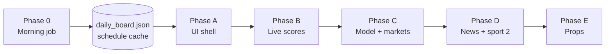

# Parlay Builder — product roadmap (v2)

**Vision:** ESPN-like sports hub (news, live ticker, sport pages, game detail) with model picks, markets, parlays, and props — **plus automatic morning slate/odds refresh** so the site is ready when you open it.

**Experimental tooling — not betting advice.** Keep disclaimers on every screen that shows picks or EV.

**Baseline today:** `/` → sport picker · `/mlb` → analytics table · `/api/daily` → model + odds JSON (manual **Run live** / **Refresh** only). No scheduler, live scores, logos, news, or per-game pages.

**Daily dev:** `.\scripts\dev.ps1` → http://127.0.0.1:8000

---

## Phase overview

Work **one phase at a time**. Check every box before moving on.

| Phase | Name | What ships |
|-------|------|------------|
| **0** | Morning automation | Scheduled slate + odds + model cache; optional ingest |
| **A** | ESPN shell (MLB) | Home, sport nav, game cards, game detail layout |
| **B** | Live scores | Rolling ticker, live scores, inning/status |
| **C** | Model on game page | ML / total / spread, picks, parlays per game |
| **D** | News + sport #2 | Headlines + second sport in nav/ticker |
| **E** | Player props | Prop lines on game detail (model later) |



---

## Locked decisions

| Topic | Choice |
|-------|--------|
| First live sport | **MLB** |
| Other sports in nav | Tabs visible; **Coming soon** until Phase D |
| Morning refresh time | **12:01 AM local** (Task Scheduler); optional **6:00 AM** second run for line updates |
| Refresh timezone | Machine local time unless you set Task Scheduler to Eastern |
| Spread on game page | Sportsbook **run line** display; model spread picks optional later |
| Player props | Market lines in Phase E; model recommendations when backtested |
| News | RSS headlines in Phase D; link out, no original articles |
| Layout | **Mobile-first**, dark theme |
| Old analytics table | `/mlb/board` after Phase A; Model Lab stays `/mlb/lab` |
| Server must be running for morning job? | **No** — standalone script writes cache files |

---

## Phase 0 — Morning automation

**Goal:** Every day without opening the browser, the app pre-builds today’s slate, fetches odds, runs the model, and saves JSON caches the UI reads on first load.

### What runs automatically

| Step | Action | Why |
|------|--------|-----|
| 1 | `build_daily_board(refresh=True, skip_totals=False)` | Slate + ML + O/U + parlays → `data/processed/daily_board.json` |
| 2 | Fetch MLB schedule for `date.today()` | Warm schedule cache for Phase A/B UI |
| 3 | Write `data/processed/last_morning_refresh.json` | Timestamp + status for UI (“Updated 12:03 AM”) |
| 4 | *(Optional, separate task)* `python scripts/ingest_mlb.py` | Yesterday’s results + rolling features (~5–15 min); run **~3–6 AM**, not midnight |

**Does not replace:** Live score polling (Phase B, ~60s during games) or manual **Refresh** when lines move before first pitch.

### Backend / scripts

- [ ] **`scripts/morning_refresh.py`** — calls `build_daily_board(refresh=True)`; logs success/errors; exits non-zero on failure.
- [ ] **`scripts/morning_refresh.ps1`** — activates `.venv`, runs Python script, appends to log file.
- [ ] **`app/services/schedule_mlb.py`** — `refresh_schedule_cache(game_date)` writes `data/processed/mlb_schedule_{date}.json` (shared with Phase A).
- [ ] **`GET /api/status/refresh`** — returns `last_morning_refresh.json` (time, ok/error, games_count, odds_source).

### Scheduling (Windows)

- [ ] **Task 1 — Daily 12:01 AM:** `powershell -File scripts\morning_refresh.ps1`
- [ ] **Task 2 — Optional 6:00 AM:** same script (catches overnight line posts)
- [ ] **Task 3 — Optional ~4:00 AM:** `python scripts\ingest_mlb.py` (weekly or daily in season)
- [ ] Document setup in **`DEV.md`** (Task Scheduler steps, wake conditions, log path).

### Odds API / reliability

- [ ] Require `ODDS_API_KEY` in `.env` for live morning refresh; log clear warning if missing.
- [ ] Retry once on transient HTTP failure (30s backoff).
- [ ] Log Odds API usage note in `DEV.md` (each refresh = API quota).

### Acceptance criteria

- [ ] Running `morning_refresh.ps1` manually updates `daily_board.json` for today with `refresh=true` behavior.
- [ ] Scheduled task runs without user logged in (if PC is on).
- [ ] `/api/daily` returns cached morning board without clicking **Run live**.
- [ ] `/api/status/refresh` shows last run time and success/failure.
- [ ] Failed run leaves previous cache intact and logs error (no empty overwrite).

### Suggested order

1. `morning_refresh.py` + test with `pytest` (mock `build_daily_board`)
2. `morning_refresh.ps1` + manual run
3. `schedule_mlb.py` cache writer (stub OK if Phase A not started)
4. `/api/status/refresh`
5. Task Scheduler + `DEV.md`

**Estimate:** 1 session.

**Start command:** `.\scripts\morning_refresh.ps1`

---

## Phase A — ESPN shell (MLB)

**Goal:** Home → MLB game list with logos → game detail layout. Reads morning cache when present (Phase 0).

### Backend

- [ ] **`GET /api/schedule/mlb?date=YYYY-MM-DD`** — from cache file if fresh (&lt; 6h), else MLB Stats API. Fields: `game_id`, teams, `team_id`s, `start_time_utc`, `status`, scores (null pre-game).
- [ ] **`GET /api/games/mlb/{game_id}`** — single game + link to daily-board row.
- [ ] **Team logos** — `https://www.mlbstatic.com/team-logos/team-cap-on-dark/{teamId}.svg`; map in `data/processed/mlb_teams.json`.
- [ ] Schedule cache refreshed by Phase 0 morning job and on-demand API miss.

### Frontend

- [ ] **`static/index.html`** — sport pills (MLB active), ticker placeholder, news placeholder, “Last updated” from `/api/status/refresh`.
- [ ] **`static/mlb_slate.html`** — game cards: logos, time, status; link → `/mlb/game/{game_id}`.
- [ ] **`static/game.html`** + **`static/game.js`** — matchup header, empty markets box, placeholders for model/parlays/props.
- [ ] **`static/app.css`** / **`static/app.js`** — shared layout, `fetchJSON`, time/logo helpers.

### Routes

- [ ] `/` → home
- [ ] `/mlb` → slate
- [ ] `/mlb/game/{game_id}` → game detail
- [ ] `/mlb/board` → old table board (link: “Advanced board”)

### Acceptance criteria

- [ ] After Phase 0 morning run, opening `/mlb` shows today’s games **without** clicking Run live.
- [ ] Logos and start times correct; tap opens game detail.
- [ ] Mobile layout works; Model Lab and `/mlb/board` still work.

**Estimate:** 1–2 sessions.

---

## Phase B — Live scores & ticker

**Goal:** Sticky rolling bar + live scores on cards and game header. Separate fast polling from morning cache.

### Backend

- [ ] Schedule fetch with **`hydrate=linescore`**; fields: `period_label` (e.g. `Bot 7th`), scores, `abstractGameState`.
- [ ] **`GET /api/scores/today?sport=mlb`** — all games today for ticker; cache **30–60s**.
- [ ] Morning job (Phase 0) still runs once; live endpoint polls during the day.

### Frontend

- [ ] Sticky ticker on home, `/mlb`, game pages; auto-refresh **60s**.
- [ ] Game cards: LIVE / Final badges, scores, inning label.
- [ ] Game detail header: scores + center status when live.

### Acceptance criteria

- [ ] Ticker shows every MLB game today (scheduled / live / final).
- [ ] Live game updates score/inning without full page reload.
- [ ] Morning cache and live scores coexist (no stale final scores blocking live).

**Estimate:** 1–2 sessions.

---

## Phase C — Model, markets & parlays on game page

**Goal:** Game detail = main product page. Uses morning `daily_board.json` + live schedule.

### Backend

- [ ] **`GET /api/games/mlb/{game_id}/insights`** — merge schedule, daily-board row, run line from Odds API (display), parlays containing this game.
- [ ] Optional query `?refresh=true` bypasses 5-min board TTL (same as `/api/daily`).
- [ ] Document spread/run line in `DEV.md`.

### Frontend

- [ ] Markets box: Moneyline | Total | Spread (American odds + implied %).
- [ ] Model block: pick, win %, estimated runs, edge, confidence.
- [ ] Parlay block: top parlays including this game; link to `/mlb/board`.
- [ ] Disclaimers on page.

### Acceptance criteria

- [ ] Pre-game: ML, O/U, spread from morning refresh (or “—” if no key).
- [ ] Model pick matches `/api/daily` for same `game_id`.
- [ ] Demo: `?date=2025-08-15&use_cache=true` works on insights.

**Estimate:** 1–2 sessions.

---

## Phase D — News & second sport

**Goal:** Home headlines; second sport tab + multi-sport ticker.

### News

- [ ] **`GET /api/news`** — RSS, cache 15 min; `title`, `link`, `published`, `source`.
- [ ] Home headline list (5–10 items); external links.

### Second sport

- [ ] Repeat schedule + logos + live pattern for chosen sport (NBA when ready).
- [ ] Ticker merges MLB + sport #2 by start time.
- [ ] Morning job extended: `morning_refresh.py` accepts `--sports mlb,nba` when NBA ships.

### Acceptance criteria

- [ ] Headlines load or graceful fallback.
- [ ] Two sports in ticker; MLB unchanged.
- [ ] Second sport game list works (model block optional until model exists).

**Estimate:** 1 session (news) + 2–4 sessions per sport.

---

## Phase E — Player props

**Goal:** Props section on game detail; recommendations later.

### Backend

- [ ] **`GET /api/games/mlb/{game_id}/props`** — Odds API player props; cache per game (TTL TBD, document quota).
- [ ] Optional: include props in midday refresh only (save API calls at 12:01 AM).

### Frontend

- [ ] Props table on game detail (collapsible mobile).
- [ ] “Recommended” tab when model exists; else market-only.

### Acceptance criteria

- [ ] Props load when API key set and market available.
- [ ] Clear empty state; disclaimer present.

**Estimate:** 2–3 sessions.

---

## After Phase E — full checklist

| Capability | Done after |
|------------|------------|
| Auto morning slate + odds | Phase **0** |
| ESPN home / sport / game flow | Phase **A** |
| Live ticker + scores | Phase **B** |
| Logos | Phase **A** |
| ML / total / spread + model pick | Phase **C** |
| Parlays on game page | Phase **C** |
| News | Phase **D** |
| Second sport | Phase **D** |
| Player props (market) | Phase **E** |
| Player props (model) | Follow-up |
| All five sports | Roll out per sport after D |
| Spread model picks | Optional follow-up |

---

## Refresh strategy (whole product)

| When | What | How |
|------|------|-----|
| **12:01 AM** (default) | Full board + schedule cache | Task Scheduler → `morning_refresh.ps1` |
| **6:00 AM** (optional) | Re-fetch odds + board | Second scheduled task |
| **User opens site** | Read caches | No API unless stale |
| **During games** | Scores only | Phase B poll ~60s |
| **User clicks Refresh** | Force board rebuild | `?refresh=true` |
| **~4 AM** (optional) | Historical ingest | `ingest_mlb.py` separate task |
| **Afternoon** | Forward CLV backfill | Existing `backfill_forward_clv.py` |

---

## File map

```
app/
  main.py
  services/
    schedule_mlb.py          # Phase 0 + A + B
    game_insights.py           # Phase C
    news_feed.py               # Phase D
    props_mlb.py               # Phase E
scripts/
  morning_refresh.py           # Phase 0
  morning_refresh.ps1          # Phase 0
  ingest_mlb.py                # optional 4 AM task (existing)
data/processed/
  daily_board.json             # morning + on-demand
  mlb_schedule_YYYY-MM-DD.json # morning + API
  last_morning_refresh.json    # Phase 0
  mlb_teams.json               # Phase A
static/
  index.html
  mlb_slate.html
  game.html / game.js
  app.css / app.js
  mlb_board.html               # moved old board
tests/
  test_morning_refresh.py
  test_schedule_mlb.py
  test_game_insights.py
ROADMAP.md
DEV.md                         # scheduler + API notes each phase
```

---

## Start here

**Phase 0 first** (automation before UI polish):

1. `scripts/morning_refresh.py`
2. `scripts/morning_refresh.ps1`
3. Register Windows Task Scheduler for **12:01 AM daily**
4. `GET /api/status/refresh`
5. Verify: run script → open `/api/daily` → today’s board present

Then say **“start Phase A”** for the ESPN shell.

---

## Success metrics (unchanged)

| Metric | Where |
|--------|--------|
| Forward CLV | `GET /api/clv/summary` |
| Market eval | `MARKET.md` / `evaluate_mlb_market.py` |
| Model lab | `/mlb/lab` |

UI surfaces existing edge logic — it does not change model thresholds.

---

## Optional follow-ups (post–Phase E)

- VPS deploy + cron instead of Windows Task Scheduler
- In-app APScheduler (only if server runs 24/7)
- Push notification / email when morning refresh finds +EV parlays
- Prop and spread **models** with backtests
